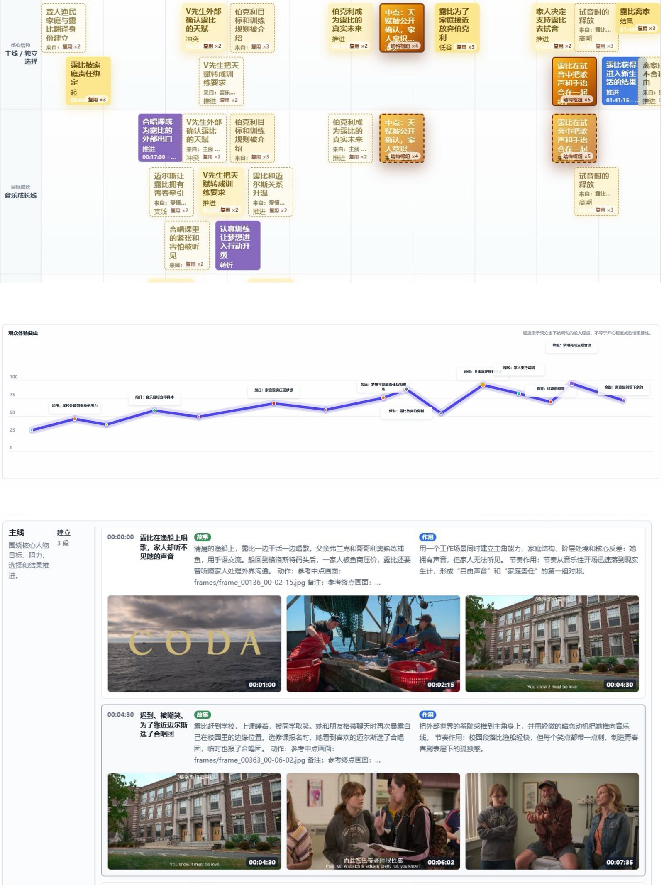

# Lapian Notes — AI-assisted film study notebook

[](https://discord.gg/uT6xryBX9w)
[](https://x.com/bkingfilm)
[](https://github.com/bkingfilm/lapian-notes/releases/latest)
[](LICENSE)

Turn a film into an editable shot-by-shot study notebook ("拉片" — the Chinese film-school practice of pulling a film apart scene by scene).

Everything runs locally. Your film and notes never leave your machine. Bring your own AI — no API key required.

> **Note**: the UI is currently Chinese-only. [中文说明 →](README.md)



## What it does

- **Film timeline**: extracts one frame per second locally, builds a visual timeline
- **AI analysis package**: bundles frames + subtitles into a ZIP you hand to ChatGPT or any AI (a task prompt and JSON schema are included); import the returned JSON and get:
- **Story-line swimlanes**: segments laid out across story lines that the AI names for this specific film, with cross-line reference cards
- **Structure tree and audience-emotion curve**: narrative grouping plus a beat-by-beat engagement curve
- **Deep-dive per segment**: export any single segment as a small package for scene- and shot-level breakdown
- **Built-in player sync**: click any timestamp in your notes to jump the video there
- **Full manual editing**: every AI field is an editable draft; export the whole notebook as Markdown or a shareable long image

## Quick start

Requires Node.js 18+ and a Chromium browser. [ffmpeg](https://ffmpeg.org/) is optional (enables auto-transcoding of RMVB/AVI/HEVC).

```bash
npm install
npm run dev
```

Open the printed localhost address. On Windows you can simply double-click `run.bat`; on macOS double-click `run.command` (first run: Control-click → Open).

Note for international users: the automatic subtitle search targets a Chinese subtitle site, and the bootstrap scripts prefer China-based mirrors. Manual subtitle import (SRT/ASS/VTT) works everywhere.

## Data

Notes autosave to localStorage, frame images to IndexedDB — all local. "备份 ZIP" (Backup ZIP) exports a self-contained archive (notes + frames + Markdown) for backup, sharing or moving machines.

## License

[MIT](LICENSE)
